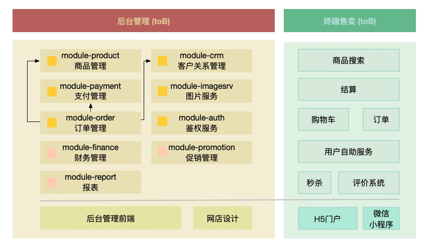

# 简介

`bcMall` 是一个以`教学`为目的的电商系统。bcMall将为你展现一个典型的系统演进过程，所使用的主流技术完全开放。

它包含ToB复杂业务、互联网高并发业务、缓存应用；DDD、微服务指导。模型驱动、数据驱动。了解大型服务进化路线，编码技巧、学习Linux，性能调优。Docker/k8s助力、监控、日志收集、中间件学习。前端技术、后端实践等。主要技术：`SpringBoot`+`JPA`+`Mybatis-plus`+`Antd`+`Vue3`。

# 项目信息

通过下面的链接可快速体验。

## 后台管理模块 (toB)

- Java后端管理代码 ：https://github.com/xjjdog/bcMall
- 后台体验地址：http://bcmall.xjjdog.cn/
- 配套教程和文档：http://xjjdog.cn/ 
- Antd前端管理代码：整理上传中...

## 售卖模块 (toC) 

敬请期待...

# 模块划分

`bcMall`采用了一种更加容易理解、扩展性更强的模块划分方式。更方便的由单体应用向分布式应用过渡。

由于B端的技术栈，与C端的不太一样，按照模块划分可以使用单独的技术栈而互不影响。做后台管理，没必要使用C端的技术折腾自己。

为了支持原型驱动开发模式，bc-utils提供了`magicjpa`和`smartjdbc`两种无敌的代码hack模式，使用很少很少的代码就可以实现功能的快速验证。

想赚外快的同学可以直接拿走这两个工具。

参考代码：
- `magicjpa` https://github.com/xjjdog/bcMall/tree/master/bc-utils/src/main/java/cn/xjjdog/bcmall/utils/quickdev/magicjpa
- `smartjdbc` https://github.com/xjjdog/bcMall/tree/master/bc-utils/src/main/java/cn/xjjdog/bcmall/utils/quickdev/smartjdbc

# 主要技术

前端使用开箱即用的`antd pro`，开发语言采用`typescript`。ts是最接近后端开发的一门语言，比vue开发效率高很多，一周撸一个系统不是梦。

后端主要是用`springboot`。主要的技术点有：

- `mysql mariadb`  关系型数据库
- `redis`KV数据库
- `elasticsearch` NoSQL+全文检索
- `spring-boot-jpa` 应用广泛的ORM框架。快速开发，告别恼人的表设计
- `mybatis-plus` 为特殊模块准备的ORM框架
- `hibernate-validator` 专业的参数验证框架
- `swagger` 文档生成器，rest接口测试
- `p6spy` 打印sql，调试功能
- `guava` 广泛应用的google的工具类库
- `vavr` lambda表达式扩展包，缩减代码
- `mapstruct` 对象转换类库，节省getset
- `lombok` 地球人都知道的节省代码工具类
- `hikaricp` 速度最快的数据库连接池
- `jwt+spring security` 权限认证
- `jsoup` 爬虫工具
- `flyway` 表变更维护工具
- `kafka` 高可靠高吞吐的消息队列
- `nginx` 反向代理软件
- `oss` 阿里云的图片服务

# 开发工具

在开发中，使用了`Macbook`、`Windows`、`Linux`等桌面平台，所以bcMall是跨平台的。另外还使用了如下的开发工具：

- `CentOS Linux` 运行容器，与大厂接轨
- `Windows WSL2` 运行容器，Windows下最好用的Linux环境  
- `IDEA社区版` 专业的Java IDE，社区版不占资源
-  `VSCode` 前端开发工具
-  `DBeaver` 数据库管理软件
-  `Ominigraffle | viso` 绘图软件
-  `XMind ZEN` 思维导图工具
-  `React Developer Tools` React代码调试
-  `Postman | curl` API接口快速调试工具

# 文档 & 技术解析

最新配套文章，将第一时间发布到《小姐姐味道》微信公众号。直接搜索`xjjdog`或者扫描下面的二维码关注即可。

更多支持：加`xjjdog0`好友，进入讨论组。

# 已有教程备份

为了让知识系统化，我给大家准备了几个专业索引。

「概览」[必看！java后端，亮剑诛仙](http://mp.weixin.qq.com/s?__biz=MzA4MTc4NTUxNQ==&mid=2650520027&idx=1&sn=5ff6be6dbcae34256c85ac7a79fefba4&chksm=8780be1fb0f73709aaaf3f891f239d4ed7cb039caa1662094e0653dce327f62139c6b1264200&scene=21#wechat_redirect)  
「选型」[学完这100多技术，能当架构师么？](http://mp.weixin.qq.com/s?__biz=MzA4MTc4NTUxNQ==&mid=2650520208&idx=1&sn=4cd66f87430e60ff7797337d67ef20a7&chksm=8780bd54b0f73442f78335204080c49298a069192e9f74d76ea3b6fb285ef3a647730d3c5954&scene=21#wechat_redirect)  
「Linux」[Linux上，最常用的一批命令解析](http://mp.weixin.qq.com/s?__biz=MzA4MTc4NTUxNQ==&mid=2650519865&idx=1&sn=e6c15ef16b8ee81f71924d9757a8c608&chksm=8780befdb0f737ebf616a2bdbd2ae26215830139ea560e52602d350a6d5c26088365dfd3853f&scene=21#wechat_redirect)  
「职业规划」[能跑的不如会跑的，浅谈JAVA职业发展路线](https://mp.weixin.qq.com/s/YZBhfbVMg3D27xYb-20PXQ)

当然，你可以看一下[《2020当头一棒：阅读最高的，竟然是这些文章》](https://mp.weixin.qq.com/s/LnKNW9mUs5DXghRMcgqTbw)，对我快速了解。

下面的原创文章，都是依托于此，进行面线点的展开。主要的特点是：`系统化`，`体系化`。

### 二层索引

​随着文章的增多，需要进行一下整理，不能让一些充数的文章太过嚣张。公众号的形式很烂，适合热点，但不适合体系化知识，这也是我整理这篇文章的原因。二层索引依然是一些比较概括性的整体介绍。

「微服务」[这次要是讲不明白Spring Cloud核心组件，那我就白编这故事了](http://mp.weixin.qq.com/s?__biz=MzA4MTc4NTUxNQ==&mid=2650520070&idx=1&sn=d4dd3513db415cd7be209898880f41e6&chksm=8780bdc2b0f734d41ff2e790b97cc1733f6bfdc84d669db6d27ca6eec05cc13cf4520e3ac63a&scene=21#wechat_redirect)   
「微服务」[微服务不是全部，只是特定领域的子集](https://mp.weixin.qq.com/s?__biz=MzA4MTc4NTUxNQ==&mid=2650519373&idx=1&sn=e3aeeb36137a8a20765ee6bfa902071c&scene=21#wechat_redirect)  
「消息」[分布式消息系统，设计要点。画龙画虎难画骨](http://mp.weixin.qq.com/s?__biz=MzA4MTc4NTUxNQ==&mid=2650520278&idx=1&sn=2493fdf575043975ffd9dcf9a170ab26&chksm=8780bd12b0f734048a87da21c84c4e214c4a8b4619596c0c876b166725a7545cd75baba601d9&scene=21#wechat_redirect)  
「监控」[这么多监控组件，总有一款适合你](https://mp.weixin.qq.com/s?__biz=MzA4MTc4NTUxNQ==&mid=2650518678&idx=1&sn=8c8c9c40620b649cfb673ecef70a23f4&scene=21#wechat_redirect)  
「分库分表」[“分库分表” ？选型和流程要慎重，否则会失控](https://mp.weixin.qq.com/s?__biz=MzA4MTc4NTUxNQ==&mid=2650519118&idx=1&sn=fc4b92154cb9ab6dcec5b5544c6274aa&scene=21#wechat_redirect)  
「数据同步」[希望一个数据同步，包治百病](https://mp.weixin.qq.com/s?__biz=MzA4MTc4NTUxNQ==&mid=2650519650&idx=1&sn=f59de32a719a0e026be70010c09ef7bb&scene=21#wechat_redirect)  
「缓存」[这可能是最中肯的Redis规范了](http://mp.weixin.qq.com/s?__biz=MzA4MTc4NTUxNQ==&mid=2650519808&idx=1&sn=78d404047311bdc83a3a9f650e045f06&chksm=8780bec4b0f737d29ac59abcb3aef6224ffd2769bd7fbd875ff8c1d01755bfe4ea6ca2df5461&scene=21#wechat_redirect)  
「持续集成」[发布系统有那么难么?](https://mp.weixin.qq.com/s?__biz=MzA4MTc4NTUxNQ==&mid=2650518647&idx=1&sn=8e616b6ff14d69d31db768a131b572c4&scene=21#wechat_redirect)  
「分布式存储」[也浅谈下分布式存储要点](https://mp.weixin.qq.com/s?__biz=MzA4MTc4NTUxNQ==&mid=2650519373&idx=1&sn=e3aeeb36137a8a20765ee6bfa902071c&scene=21#wechat_redirect)  
「网络开发」[使用Netty，我们到底在开发些什么？](https://mp.weixin.qq.com/s?__biz=MzA4MTc4NTUxNQ==&mid=2650519418&idx=1&sn=b465291cbc396a0b665ed120d1176f68&scene=21#wechat_redirect)  
「ES」[上厅房，下厨房，ElasticSearch有的忙](https://mp.weixin.qq.com/s?__biz=MzA4MTc4NTUxNQ==&mid=2650519357&idx=1&sn=bba495853c02a2751c654de8a5df0545&scene=21#wechat_redirect)  
「LBS」[如何使用postgis做一个高可用的附近的人服务？](https://mp.weixin.qq.com/s?__biz=MzA4MTc4NTUxNQ==&mid=2650518469&idx=1&sn=f02f00b4fdbf1299a19b2ad2945a2719&scene=21#wechat_redirect)  
「WS」[WebSocket协议 8 问](https://mp.weixin.qq.com/s?__biz=MzA4MTc4NTUxNQ==&mid=2650519450&idx=1&sn=a8ba905f2410671cb8e2f8ec6b33a7a9&scene=21#wechat_redirect)  
「多线程」[JAVA多线程使用场景和注意事项简版](https://mp.weixin.qq.com/s?__biz=MzA4MTc4NTUxNQ==&mid=2650519426&idx=1&sn=918ac0897fc13db86b5848a5478f9b66&scene=21#wechat_redirect)  
「安全」[那些需要自己开发的安全需求](https://mp.weixin.qq.com/s?__biz=MzA4MTc4NTUxNQ==&mid=2650519465&idx=1&sn=b0c8c0340439184b2d00a9e0f5f06474&scene=21#wechat_redirect)

### 三层体系化

在这里，我将文章按照分类进行了整理。如果你需要相关的内容，可进行快速定位。

#### 微服务体系
「整体」[这次要是讲不明白Spring Cloud核心组件，那我就白编这故事了](http://mp.weixin.qq.com/s?__biz=MzA4MTc4NTUxNQ==&mid=2650520070&idx=1&sn=d4dd3513db415cd7be209898880f41e6&chksm=8780bdc2b0f734d41ff2e790b97cc1733f6bfdc84d669db6d27ca6eec05cc13cf4520e3ac63a&scene=21#wechat_redirect)   
「整体」[微服务不是全部，只是特定领域的子集](https://mp.weixin.qq.com/s?__biz=MzA4MTc4NTUxNQ==&mid=2650519373&idx=1&sn=e3aeeb36137a8a20765ee6bfa902071c&scene=21#wechat_redirect)    
「SCG」[万字Spring Cloud Gateway2.0，面向未来的技术，了解一下？](http://mp.weixin.qq.com/s?__biz=MzA4MTc4NTUxNQ==&mid=2650520384&idx=1&sn=a2b575683057ac40d74409fcde786195&chksm=8780bc84b0f735920ba71e72d53cff4bb2e8b312bfac378fa0612e34fd902503b2f04f1d9930&scene=21#wechat_redirect)  
「Trace」[2w字长文，让你瞬间拥有「调用链」开发经验](http://mp.weixin.qq.com/s?__biz=MzA4MTc4NTUxNQ==&mid=2650520479&idx=1&sn=a1a0f2d250c9d4e8b77529fcf61968ea&chksm=8780bc5bb0f7354d31258d57c2b7a412928f79fec170967ffc6aea53b28aea28c3b3fc8f5de2&scene=21#wechat_redirect)  
「熔断」[轻拢慢捻，微服务熔断大总管](http://mp.weixin.qq.com/s?__biz=MzA4MTc4NTUxNQ==&mid=2650520326&idx=1&sn=0604fb0591afb66c69b542b2a6ffaae9&chksm=8780bcc2b0f735d4ad28d97a4934ddf7d4edb77b0376f7d68c10476fe8067345216285e74f2f&scene=21#wechat_redirect)

#### 消息体系
「整体」[分布式消息系统，设计要点。画龙画虎难画骨](http://mp.weixin.qq.com/s?__biz=MzA4MTc4NTUxNQ==&mid=2650520278&idx=1&sn=2493fdf575043975ffd9dcf9a170ab26&chksm=8780bd12b0f734048a87da21c84c4e214c4a8b4619596c0c876b166725a7545cd75baba601d9&scene=21#wechat_redirect)  
「Kafka」[Kafka基础知识索引](https://mp.weixin.qq.com/s?__biz=MzA4MTc4NTUxNQ==&mid=2650519314&idx=1&sn=69c16694e2a2f0e35188ccf3e1aa3e70&scene=21#wechat_redirect)  
「Kafka」 [360度测试：KAFKA会丢数据么？其高可用是否满足需求？](https://mp.weixin.qq.com/s?__biz=MzA4MTc4NTUxNQ==&mid=2650518478&idx=1&sn=a95a9b61166029be0979e8ec3cd97783&scene=21#wechat_redirect)  
「Kafka」 [使用多线程增加kafka消费能力](https://mp.weixin.qq.com/s?__biz=MzA4MTc4NTUxNQ==&mid=2650519439&idx=1&sn=8762e88082a26ff5c85d133d120992ba&scene=21#wechat_redirect)  
「AMQ」[ActiveMQ架构设计与最佳实践，需要一万字](https://mp.weixin.qq.com/s/Zg5TKHk8g0tQ7Xz186rt2g)  
「MQ」[开源一个kafka增强：okmq-1.0.0](https://mp.weixin.qq.com/s/xD8AL9vCJsH9xDoztabK-A)

#### 监控体系

「整体」[这么多监控组件，总有一款适合你](https://mp.weixin.qq.com/s/rdD54-zyapjlubM5K1jUeQ)    
「日志」[elkb实践经验，再赠送一套复杂的配置文件](https://mp.weixin.qq.com/s/g5Ln6-fB4Y2bYnx_dC7gSw)    
「日志」[日志收集的“DNA”](https://mp.weixin.qq.com/s/ySJudWmuQfKRFY2snKIs1w)  
「日志」[实践一把Loki，体验掌上起舞的轻盈](https://mp.weixin.qq.com/s/J-wKzulUa-pnS8Zg6vi-Ww)  
「日志」[你的野花，朕的kibana](http://mp.weixin.qq.com/s?__biz=MzA4MTc4NTUxNQ==&mid=2650520518&idx=1&sn=8308855c629e4088f047c3efb0f3cc4b&chksm=8780bc02b0f73514f6d34b127405f573d33bb3f8a19754b478f20a3bdae1a5da1d0d8c13e978&scene=21#wechat_redirect)  
「日志」[一般人不敢动系列之—基于logback的日志“规范”和“脱敏”](https://mp.weixin.qq.com/s/N8s5XX6Y8eXI9oKnwQow_g)  
「监控」[ 昔日教人类用火的prometheus，如今在努力报警](https://mp.weixin.qq.com/s/ZxsKqY7fJjb9TF0tZA9rSQ)  
「APM」[ 2w字长文，让你瞬间拥有「调用链」开发经验](https://mp.weixin.qq.com/s/WciiwCyI2A_JAvCyhN6uCg)   
「APM」[ 这一轮，skywalking胜出](https://mp.weixin.qq.com/s/XUgVtjTp_B5-wXhZ3lFGiw)  
「底层」[ 冷门instrument包，功能d炸天](https://mp.weixin.qq.com/s/p2XWbydAVPqo7PDsOttqjA)  
「底层」[你的也是我的。3例ko多线程，局部变量透传](http://mp.weixin.qq.com/s?__biz=MzA4MTc4NTUxNQ==&mid=2650520228&idx=1&sn=bcf6db2337e3823b3139e5d302ed4386&chksm=8780bd60b0f73476e157651ff58556a8f9c29d93d2a6bf084c13b17d507c7c02b0e15e7f2b95&scene=21#wechat_redirect)

#### 数据治理

「分库分表」[“分库分表” ？选型和流程要慎重，否则会失控](https://mp.weixin.qq.com/s?__biz=MzA4MTc4NTUxNQ==&mid=2650519118&idx=1&sn=fc4b92154cb9ab6dcec5b5544c6274aa&scene=21#wechat_redirect)  
「数据同步」[希望一个数据同步，包治百病](https://mp.weixin.qq.com/s?__biz=MzA4MTc4NTUxNQ==&mid=2650519650&idx=1&sn=f59de32a719a0e026be70010c09ef7bb&scene=21#wechat_redirect)  
「数据同步」[由 Canal 组件分析集成中间件架构的一般过程](https://mp.weixin.qq.com/s?__biz=MzA4MTc4NTUxNQ==&mid=2650518518&idx=1&sn=7b46683cb00372a95241e7b8d448e36c&scene=21#wechat_redirect)  
「分库分表」[分库分表“实践”大全](http://mp.weixin.qq.com/s?__biz=MzA4MTc4NTUxNQ==&mid=2650520446&idx=1&sn=3752fed6431331b9154bed47b70c7360&chksm=8780bcbab0f735acbfa5b5f74f81d39c643b0b37d0e3b62293dda6cd52da5024c56f8043ba46&scene=21#wechat_redirect)  
「HA」[”MySQL官方驱动“主从分离的神秘面纱](https://mp.weixin.qq.com/s?__biz=MzA4MTc4NTUxNQ==&mid=2650519295&idx=1&sn=2be70fee1af2706ae3fc0269548d364d&scene=21#wechat_redirect)  
「Sharding」 [现实中的路由规则，可能比你想象中复杂的多](https://mp.weixin.qq.com/s?__biz=MzA4MTc4NTUxNQ==&mid=2650519490&idx=1&sn=ce157a5d2da87b5956110ac2a4409bb6&scene=21#wechat_redirect)  
「Sharding」 [非规范SQL的sharding\-jdbc实践](https://mp.weixin.qq.com/s?__biz=MzA4MTc4NTUxNQ==&mid=2650519342&idx=1&sn=8a3eebbceb518ba774660ee1129f6cb5&scene=21#wechat_redirect)  
「云库」[MySQL痿了，放不下这么多数据！](http://mp.weixin.qq.com/s?__biz=MzA4MTc4NTUxNQ==&mid=2650519787&idx=1&sn=5194dc48afdaeb7d3b97545f45e273ea&chksm=8780bf2fb0f73639700eaf0412b759062d457d1690ff7fd19e78f309b3bb58b0d34ba5ab58ef&scene=21#wechat_redirect)  
「云库」[记一次操蛋的方案降级（云上冷热分离的坎坷之路）](http://mp.weixin.qq.com/s?__biz=MzA4MTc4NTUxNQ==&mid=2650520364&idx=1&sn=16603e8a999e93e2f64c77a204de58a8&chksm=8780bce8b0f735fe289a1aad18603c257456fb7f846145b5e5f4cc8ea7f14a4a6b785cb05df3&scene=21#wechat_redirect)

#### 缓存体系

「Redis」[这可能是最中肯的Redis规范了](http://mp.weixin.qq.com/s?__biz=MzA4MTc4NTUxNQ==&mid=2650519808&idx=1&sn=78d404047311bdc83a3a9f650e045f06&chksm=8780bec4b0f737d29ac59abcb3aef6224ffd2769bd7fbd875ff8c1d01755bfe4ea6ca2df5461&scene=21#wechat_redirect)  
「Redis」[与亲生的Redis Cluster，来一次亲密接触](http://mp.weixin.qq.com/s?__biz=MzA4MTc4NTUxNQ==&mid=2650520049&idx=1&sn=17a260f877b3ac4ff2b393981213ff94&chksm=8780be35b0f737233d9039cf33c0141a31f337febab06dc68ae052b0ee2056fe841c35aa9e00&scene=21#wechat_redirect)  
[redis的zset有多牛？请把耳朵递过来](https://mp.weixin.qq.com/s/LCcsicS7kRuHNBkJXFltLQ)  
「Redis」[好慌，Redis这么多集群方案，要用哪种？](http://mp.weixin.qq.com/s?__biz=MzA4MTc4NTUxNQ==&mid=2650522116&idx=1&sn=3d64b7e8273a11cec64b96208a7e6ff0&chksm=8780c5c0b0f74cd60b72924fe767dad50a6090e26f3552d95f86a77a52afe04d1030889224d2&scene=21#wechat_redirect)  
「协议」[架构秘笈：移花接木。使用mysql模拟redis](http://mp.weixin.qq.com/s?__biz=MzA4MTc4NTUxNQ==&mid=2650520298&idx=1&sn=7a34db9899c90713346e430d284be3a0&chksm=8780bd2eb0f73438f6a2ae40abba467f5683f0a225f0c1022d728e5c913b84c0dc7b6ceb95c3&scene=21#wechat_redirect)      
「Redis」[Redis都要老了，你还在用什么古董客户端？](https://mp.weixin.qq.com/s/6v1OgmjGsdjkSfhCb_Udrw)  
「堆内」[新一代缓存Caffeine，速度确实比Guava的Cache快](https://mp.weixin.qq.com/s/o36bOmnBUjX1ef13Xnf-7Q)
#### 高并发
「限流」[高并发之限流，到底限的什么鬼 ](http://mp.weixin.qq.com/s?__biz=MzA4MTc4NTUxNQ==&mid=2650519900&idx=1&sn=fffec19dc1bd5cacbdf0e1f3834effa3&chksm=8780be98b0f7378edb65fd462301277edd40f16be9e6ae76fb52b74cc8cfa30bc71c052d10a4&scene=21#wechat_redirect)  
「限流」[信号量限流，高并发场景不得不说的秘密](http://mp.weixin.qq.com/s?__biz=MzA4MTc4NTUxNQ==&mid=2650519882&idx=1&sn=c71bb65f280e98ed34c541be8abd483f&chksm=8780be8eb0f7379803e34a06b047d136f329071b5b72a579de09a99d0024dd2bc62b6a66fd78&scene=21#wechat_redirect)  
「熔断」[轻拢慢捻，微服务熔断大总管](http://mp.weixin.qq.com/s?__biz=MzA4MTc4NTUxNQ==&mid=2650520326&idx=1&sn=0604fb0591afb66c69b542b2a6ffaae9&chksm=8780bcc2b0f735d4ad28d97a4934ddf7d4edb77b0376f7d68c10476fe8067345216285e74f2f&scene=21#wechat_redirect)  
「预热」[没有预热，不叫高并发，叫并发高](http://mp.weixin.qq.com/s?__biz=MzA4MTc4NTUxNQ==&mid=2650519852&idx=1&sn=92a3b04418223c93f36c2922d57d0833&chksm=8780bee8b0f737feb03474848fbbac0570fb0c2c6c9a1b722862f2c0dadd0a2dc7a129582c07&scene=21#wechat_redirect)   
「高可用」[这样的高可用，我不要！](http://mp.weixin.qq.com/s?__biz=MzA4MTc4NTUxNQ==&mid=2650519813&idx=1&sn=d26c7b2f858077f27e100b157256bb57&chksm=8780bec1b0f737d7699351528fe4bcdacffc4e7582a3557aba0aa63fc6d071f9b066e0c29424&scene=21#wechat_redirect)  
「乐观锁」[余额，危险的操作，给996留点福报](https://mp.weixin.qq.com/s?__biz=MzA4MTc4NTUxNQ==&mid=2650519500&idx=1&sn=96818303f30063d6aafc460c068c9e34&scene=21#wechat_redirect)  
「秒杀」[系统设计要点，从卖病鹅说起](http://mp.weixin.qq.com/s?__biz=MzA4MTc4NTUxNQ==&mid=2650520247&idx=1&sn=ad7cec306e9810d03ce2f35d6a588b09&chksm=8780bd73b0f7346573aaf3a8ea551e7da57f451ba193b1c14cfaf371f805ed2cabbd6ee86252&scene=21#wechat_redirect)  
「秒杀」[what？秒杀也可以做引擎？](http://mp.weixin.qq.com/s?__biz=MzA4MTc4NTUxNQ==&mid=2650520287&idx=1&sn=ffd480f572e7ef5c02d094b8c9854666&chksm=8780bd1bb0f7340ded58be9ecd904f6169d701817eff02ca821191cff11018677335a6812aae&scene=21#wechat_redirect)  
[	HA（高可用）就像套娃，像胖子，剥掉一层还有一层](http://mp.weixin.qq.com/s?__biz=MzA4MTc4NTUxNQ==&mid=2650522164&idx=1&sn=ae9f0605ae1da41df7525e1f43d86583&chksm=8780c5f0b0f74ce6dfd2b6218bc4ab4b957ba0cc6e3a5e637fc0fb9e924f7cfd1019313363b5#rd)

#### DevOps
「持续集成」[发布系统有那么难么?](https://mp.weixin.qq.com/s?__biz=MzA4MTc4NTUxNQ==&mid=2650518647&idx=1&sn=8e616b6ff14d69d31db768a131b572c4&scene=21#wechat_redirect)  
「流程」[技术评审，你拿什么来吐槽？](http://mp.weixin.qq.com/s?__biz=MzA4MTc4NTUxNQ==&mid=2650520612&idx=1&sn=37b98d7b900814f6512266c439bdb1f4&chksm=8780bbe0b0f732f6da48680f2eebede30feefbebf8e18383c0eaf8cd580449f272d0fd8d03a2&scene=21#wechat_redirect)  
「流程」[研发里那只看不见的手，勒的很疼](https://mp.weixin.qq.com/s/IJtis582PcPtdZe3X9MW5w)  
「规范」[外来规范水土不服？手把手教你怎么扩展阿里规范idea插件](https://mp.weixin.qq.com/s/q-npaokRIuqfs-O-8LnfPA)  
「工具」[有了MinIO，你还会用FastDFS么？](https://mp.weixin.qq.com/s/QMIzk5Krf0YB5ov9Bk8x1w)  

#### 安全体系

「安全」[那些需要自己开发的安全需求](https://mp.weixin.qq.com/s?__biz=MzA4MTc4NTUxNQ==&mid=2650519465&idx=1&sn=b0c8c0340439184b2d00a9e0f5f06474&scene=21#wechat_redirect)  
「黑产」[模拟邮件服务器，批量注册利器](https://mp.weixin.qq.com/s?__biz=MzA4MTc4NTUxNQ==&mid=2650518524&idx=1&sn=8f7754ec3d976b4af70066d7a5589351&scene=21#wechat_redirect)   
「劫持」[运营商劫持狠起来，连json都改](http://mp.weixin.qq.com/s?__biz=MzA4MTc4NTUxNQ==&mid=2650520420&idx=1&sn=659b46a76f25ff268aafc272babdc8d3&chksm=8780bca0b0f735b6aa4e4f3a08b7246ed3a3e4d776d7461cc5380fffd8bc01c3d1e7870034a1&scene=21#wechat_redirect)  
「指纹」[可怕的“浏览器指纹”，让你在互联网上，无处可藏](http://mp.weixin.qq.com/s?__biz=MzA4MTc4NTUxNQ==&mid=2650520646&idx=1&sn=1260cc4cbfc1067ef325c82ec685a7fb&chksm=8780bb82b0f732940e682ef0bba18560953c425593f700d2ee8d0f9c319bd241b0aafcfd8978&scene=21#wechat_redirect)  
「证书」[气哭老板的顶级密钥存放方案，又做了一件蠢事](http://mp.weixin.qq.com/s?__biz=MzA4MTc4NTUxNQ==&mid=503038432&idx=1&sn=9314971bcdee0911a744ef9f060561d5&chksm=0780c62430f74f32565c82a2fbf044fd4449faad9682e1a68887a5b4c4119748603f8dc9a001#rd)

#### Java语言体系

「JVM」[一图解千愁，jvm内存从来没有这么简单过！](https://mp.weixin.qq.com/s/mB1TwKVULY7gSqXTW9NEoA)  
「JVM」[给我1万字，也讲Java不清内存排查。1万不行来2万~.~](http://mp.weixin.qq.com/s?__biz=MzA4MTc4NTUxNQ==&mid=503038244&idx=1&sn=b949428b0944f27d6ffaef18fa74e12f&chksm=0780c6e030f74ff66c51c4f8e0ce8e4073fe68d07550d945dcfa50fc52890450dbbdad38b5f9#rd)
「JVM」[开车了，JMC坐稳 (jfr)](https://mp.weixin.qq.com/s/UDMhdG3sssl-zwwPtfd1lQ)  
「JVM」[为什么给Java代码加个空行，class文件就翻脸不认人了？](https://mp.weixin.qq.com/s/262ogDIKLAY-R6sUX6afEw)  
「工具」[Java无可匹敌的变身装备，钢铁侠客的绝密味道](https://mp.weixin.qq.com/s/IRrN8V-r3W5oRtKqHoj2jg)  
「夏令时」[一天有24个小时？别开玩笑了！](https://mp.weixin.qq.com/s/Bas9G-7jowNSB3jHGn_EMQ)  
「疑难」[Java堆外内存排查小结](https://mp.weixin.qq.com/s?__biz=MzA4MTc4NTUxNQ==&mid=2650518612&idx=2&sn=63e4a1144af53ce85f9d8d3b5df42942&scene=21#wechat_redirect)  
「Lambda」[到处是map、flatMap，啥意思？](http://mp.weixin.qq.com/s?__biz=MzA4MTc4NTUxNQ==&mid=2650519742&idx=1&sn=89166b19df9f79ff00d7d56fa37a95f1&chksm=8780bf7ab0f7366cdb071f33324c13fd4d6cf59d0598726794d22633a4d29c761c9408bca717&scene=21#wechat_redirect)  
「JVM」[Java内存故障？只是因为你不够帅！](https://mp.weixin.qq.com/s/MAebo8x356IMlASocxPqRw)  
「多线程」[JAVA高逼格面试：线程封闭](http://mp.weixin.qq.com/s?__biz=MzA4MTc4NTUxNQ==&mid=2650520658&idx=1&sn=e7dcbe1d38d82adb8a9bf35d5c847eba&chksm=8780bb96b0f73280ba56ed9350251d7726655dfbc759a3850e9b54df67b7895e7e4b463b9e57&scene=21#wechat_redirect)  
「Lambda」[面试常问的PECS原则，到底是什么鬼？](http://mp.weixin.qq.com/s?__biz=MzA4MTc4NTUxNQ==&mid=2650520627&idx=1&sn=447cc7893452252268dd5e5e20b5125f&chksm=8780bbf7b0f732e10f3dc76bf72dd8c054349fb7c7a1d84602a23e9a83fcf132807facce6e4f&scene=21#wechat_redirect)  
「多线程」[血洗多线程，抱得offer归](http://mp.weixin.qq.com/s?__biz=MzA4MTc4NTUxNQ==&mid=2650519796&idx=1&sn=89ba4637cc3e5548e22cdfb8139384e3&chksm=8780bf30b0f736268ee592082a89176bb704f0b559bfb1edde9a20c23eb1e3d987ce965ad8af&scene=21#wechat_redirect)  
「多线程」[线程池的execute方法和submit方法有什么区别？](https://mp.weixin.qq.com/s/6iKaVcqN5JRcEdo6loDQHQ)  
「unicode」[这段java太古怪](https://mp.weixin.qq.com/s?__biz=MzA4MTc4NTUxNQ==&mid=2650518760&idx=1&sn=2ec59052b43c5c2f4927b61d0ca171e2&scene=21#wechat_redirect)  
「基础」[127.0.0.1和0.0.0.0地址的区别](https://mp.weixin.qq.com/s/r0_5PJCPt4pdN6Yxo9qIcw)  
「Nio」[近2万字详解JAVA NIO2文件操作，过瘾！](https://mp.weixin.qq.com/s/WGP7ve1IBrlKLRJG41W5Gw)  
「DB」[这句简单的sql，如何加索引？颠覆了我多年的认知](http://mp.weixin.qq.com/s?__biz=MzA4MTc4NTUxNQ==&mid=2650520260&idx=1&sn=ab10083c4ccf5bf41566c979295dfc4c&chksm=8780bd00b0f73416e253a72460236b0e0ae860c212fecd02bf656f9725475f1c2432fa4ae3f1&scene=21#wechat_redirect)  
「DB」[又一批长事务，P0故障谁来背锅？](https://mp.weixin.qq.com/s/mnM0Cd_K5i3Ud-yiDZzjgw)  
「安全」[又一P1故障，锅比脸圆](https://mp.weixin.qq.com/s/V_ssA9PHYvdpt_JUL8JU2Q)  
「DB」[你能搞懂connectTimeout和socketTimeout的区别么？](https://mp.weixin.qq.com/s/ON0SAdYQvdJjvZgVOP-WNg)  
「Spring」[Springboot 2.0打包与自定义launch.script](https://mp.weixin.qq.com/s/ujUxiwdg_KDNadqU7UI55Q)  
「Spring」[一个吃货来说明Spring Boot与Spring cloud 是什么关系](https://mp.weixin.qq.com/s/x-snPMlCKWSJSguYIov_Bg)  
「Spring」[配置：application.yml中都应该写些啥？](https://mp.weixin.qq.com/s/iLRlUvKxK0T1vEtz62RLxQ)  
「Spring」[SpringCloud 服务的平滑上下线](https://mp.weixin.qq.com/s/EQQ0p4s9y0puMkzWtJrwkA)  
「Spring」[SpringBoot如何加载jar包外面的配置文件？](https://mp.weixin.qq.com/s/oszkKsiLymX1IfMcYL1d5g)  
「Spring」[再深一点：面试工作两不误，源码级理解Spring事务](https://mp.weixin.qq.com/s/9vIOl6ow04ADkIhR61KEng)  
「基础」[String.replaceAll方法，正则妙用](https://mp.weixin.qq.com/s/l7gmdEPxI87Zec3cezkvtw)  
「多线程」[Java线程池「异常处理」正确姿势：有病就得治](https://mp.weixin.qq.com/s/Lfe0hIDeHcAhvSCSiHt5sg)  
「基础」[一声叹息，jdk竟然有4个random](https://mp.weixin.qq.com/s/TCYIPZh0TyGtoyaMInOyqw)  
「使用」[ZK客户端Curator使用详解](https://mp.weixin.qq.com/s/4WEJH5kALVtXKF6BtvaUhg)  
「使用」[重温一下ZooKeeper关键点，虽然我不是很喜欢它](https://mp.weixin.qq.com/s/BWwRl8tBQnS3eETtB7ihRg)  
「编码」[3种堆内缓存算法，赠源码和设计思路](https://mp.weixin.qq.com/s/uNVB1sgXYccSWHBdTdvL-A)  
「JVM」[Java如何获取方法参数具体名称？这是个好问题！](https://mp.weixin.qq.com/s/fF55kVl-uKyp_-C5JJUvFg)

### 快速掌握Linux

Linux有`最常用`，`荒岛余生`，`调教命令行`三个系列，我整理了一份《最有用系列，百页精华》pdf，加我微信吧。微信号：`xjjdog0`。

「整体」[Linux上，最常用的一批命令解析](http://mp.weixin.qq.com/s?__biz=MzA4MTc4NTUxNQ==&mid=2650519865&idx=1&sn=e6c15ef16b8ee81f71924d9757a8c608&chksm=8780befdb0f737ebf616a2bdbd2ae26215830139ea560e52602d350a6d5c26088365dfd3853f&scene=21#wechat_redirect)  
「整体」[作为高级Java，你应该了解的Linux知识](http://mp.weixin.qq.com/s?__biz=MzA4MTc4NTUxNQ==&mid=2650520435&idx=1&sn=eb248371c43f313bf40814e760cf17c6&chksm=8780bcb7b0f735a1e5e7540aff46e6274b4310726ab810f2e4295800a745d45db51c143fc7ba&scene=21#wechat_redirect)  
「脚本」[将java进程转移到“解剖台”之前，法医都干了什么？](http://mp.weixin.qq.com/s?__biz=MzA4MTc4NTUxNQ==&mid=2650520084&idx=1&sn=b2ca0a4355f83b304715f24113e155a1&chksm=8780bdd0b0f734c6cdf898f9c11e024d3c141e58fa45ddfb36aa3f320eb38b22674aabbe9432&scene=21#wechat_redirect)

#### 最常用系列

最常用系列，快速掌握三贱客↓

[最常用的一套“Vim“技巧](https://mp.weixin.qq.com/s?__biz=MzA4MTc4NTUxNQ==&mid=2650518612&idx=1&sn=125c2cb9ee6d76a6817fb0ebc5a3c5e4&scene=21#wechat_redirect)  
[最常用的一套“Sed“技巧](http://mp.weixin.qq.com/s?__biz=MzA4MTc4NTUxNQ==&mid=2650519751&idx=1&sn=adef39cb108277731608069960692c77&chksm=8780bf03b0f73615adbb3da1fcbd342be465cc80ec6cb06a412714e474748003c3ff319e02e5&scene=21#wechat_redirect)  
[最常用的一套“AWK“技巧](http://mp.weixin.qq.com/s?__biz=MzA4MTc4NTUxNQ==&mid=2650519843&idx=1&sn=fe4a5c405a35b42a850054eb4283ff40&chksm=8780bee7b0f737f194d356c155b67d19be574454adcb8ce0d16c84e6246a718c9cf29c223512&scene=21#wechat_redirect)

#### 荒岛余生系列

`荒岛余生`系列，快速掌握故障排查↓

[Linux之《荒岛余生》（一）准备篇](https://mp.weixin.qq.com/s?__biz=MzA4MTc4NTUxNQ==&mid=2650519137&idx=1&sn=8922471455cef842b1acbd24db405bca&scene=21#wechat_redirect)  
[Linux之《荒岛余生》（二）CPU篇](https://mp.weixin.qq.com/s?__biz=MzA4MTc4NTUxNQ==&mid=2650519172&idx=1&sn=e8cade4652e257e8836f52e71d6d9a68&scene=21#wechat_redirect)  
[Linux之《荒岛余生》（三）内存篇](https://mp.weixin.qq.com/s?__biz=MzA4MTc4NTUxNQ==&mid=2650519204&idx=1&sn=b367c1987fb8c985e83a6cb90f5436a6&scene=21#wechat_redirect)  
[Linux之《荒岛余生》（四）I/O篇](https://mp.weixin.qq.com/s?__biz=MzA4MTc4NTUxNQ==&mid=2650519238&idx=1&sn=7a479485c3ea7b8d61f101ceefdab05b&scene=21#wechat_redirect)  
[Linux之《荒岛余生》（五）网络篇](https://mp.weixin.qq.com/s?__biz=MzA4MTc4NTUxNQ==&mid=2650519279&idx=1&sn=dcb57c5e7d303383280984f40d6dc356&scene=21#wechat_redirect)

#### 调教命令行系列

`调教命令行`系列，全面掌握命令行↓  
[《调教命令行01》选Linux发行版，就像挑女朋友](https://mp.weixin.qq.com/s/2aqZLt9auJabzHYqjRNHwg)    
[《调教命令行02》准备一个冰清玉洁的Linux系统](https://mp.weixin.qq.com/s/9ZbAazGNfJB_wD0jp5kFqA)    
[《调教命令行03》认识一下，感觉不是说来就来的](https://mp.weixin.qq.com/s/JdpdOeX4l78ZsYf0SMweZw)    
[《调教命令行04》触碰Linux的每个角落（长文）](https://mp.weixin.qq.com/s/4E3lfJ4N3_lD2T_KC3tX6Q)    
[《调教命令行05》对文件的基本操作](https://mp.weixin.qq.com/s/Moj_ccVrS_x9ljNlWMQMVg)    
[《调教命令行06》条条大道通罗马，罗马罗马你在哪（学习技巧）](https://mp.weixin.qq.com/s/aRNINrM6zzDdU4BwB2wa2g)  
[《调教命令行07》压缩解压（有64KB彩蛋）](https://mp.weixin.qq.com/s/yi3lBwGlKply5vXHySnc7w)   
[《调教命令行08》一文搞懂Linux权限体系](https://mp.weixin.qq.com/s/Qy1ApNHEIAdmn9Bxi3GE_A)  
[《调教命令行09》磁盘很廉价，放小电影最合适了](http://mp.weixin.qq.com/s?__biz=MzA4MTc4NTUxNQ==&mid=2650522144&idx=1&sn=e5d815efc62e80aace8d5588fb28aeea&chksm=8780c5e4b0f74cf25ef9f9abd2f22ecc0c785722e4b0d2145bbd58ee97c45f7932848a4b8ca6#rd)

#### 其他

玩转Linux↓

[实力解剖一枚挖矿脚本，风骚操作亮瞎双眼](https://mp.weixin.qq.com/s/NZ8_UZec-sARgrxcK1_Udw)  
[“kill -9”一时爽，秋后算账泪两行](https://mp.weixin.qq.com/s/AepY9Rxw_lYyuettsEHxZA)  
["Sed" 高级功能：我这小脑瓜都快绕晕了](http://mp.weixin.qq.com/s?__biz=MzA4MTc4NTUxNQ==&mid=2650519775&idx=1&sn=ed8458dbdadc224d8a73b6f78af0a74f&chksm=8780bf1bb0f7360d9eb0417e14dfb0998a589a019eb6acc565217df6237f2f5327aca718a398&scene=21#wechat_redirect)  
[LWP进程资源耗尽，Resource temporarily unavailable](https://mp.weixin.qq.com/s?__biz=MzA4MTc4NTUxNQ==&mid=2650519285&idx=1&sn=8349ed55eb05684f2f56240c7490f994&scene=21#wechat_redirect)  
[命令行版星球大战 # 挖坟会不会被打？](https://mp.weixin.qq.com/s?__biz=MzA4MTc4NTUxNQ==&mid=2650519187&idx=1&sn=6586131c500f74664040a0a6bfc0d3d7&scene=21#wechat_redirect)  
[在终端画画、炒股、玩游戏](https://mp.weixin.qq.com/s?__biz=MzA4MTc4NTUxNQ==&mid=2650519401&idx=1&sn=dc592e872615782f7aba1824bb9bed81&scene=21#wechat_redirect)  
 [这是一张top命令的动动图](http://mp.weixin.qq.com/s?__biz=MzA4MTc4NTUxNQ==&mid=2650519984&idx=2&sn=14cf8330b92ddc50db4bc2dced76208d&chksm=8780be74b0f7376204806b20ba2f0e7b72c3ad62297d5ef28196e294b8fe4969a54696a83c03&scene=21#wechat_redirect)  
[Vim漫游键，为什么不设定左手？介绍一种5x倍速漫游方式](http://mp.weixin.qq.com/s?__biz=MzA4MTc4NTUxNQ==&mid=2650520371&idx=1&sn=86ddb0776fd32a9e1ca46db58c0f669a&chksm=8780bcf7b0f735e152822c5b944b1fceb4c66f702515fd8ff52e25a270cb60e70e021312ca66&scene=21#wechat_redirect)  
[你能像鸟一样，边xx边oo么？CPU给我们的启示](https://mp.weixin.qq.com/s/jMeIp6W7pTK60qlXXDCSeQ)  
[nginx“线程池模式”探讨；据说性能提高了9倍](https://mp.weixin.qq.com/s/ivWe8-7UrN7XJ7PTXSjB3w)  
[妙啊，阻塞到底是个啥？黄袍加身，亦能谈古说今](http://mp.weixin.qq.com/s?__biz=MzA4MTc4NTUxNQ==&mid=503038272&idx=1&sn=7ceafda74d1ebe36db2c2596ff6e61ce&chksm=0780c68430f74f9207c63fe7f0c05a5ece9890de789c2c99d8d6811d29f4a49192104b6e4220#rd)  
[nc很强大，容易让人蹲号子](http://mp.weixin.qq.com/s?__biz=MzA4MTc4NTUxNQ==&mid=503038415&idx=1&sn=3fe67b71de61cd616bfd23f48ffbdb7e&chksm=0780c60b30f74f1de15e695d473853cf55fbf05c52de3403dbb33d7b623ec73fbca5775f744a#rd)  
[Windows给力！可以扔掉Linux虚拟机了！](http://mp.weixin.qq.com/s?__biz=MzA4MTc4NTUxNQ==&mid=2650522109&idx=1&sn=77ef6c4806f7e8eeb3a27f4c5e2f7399&chksm=8780c639b0f74f2fe1a750eb1898f62feba40cfc0b9a3229f78863f6c66965569918f7e0a8d7#rd)

### 小姐姐味道

当然了，你也可以从这里获得特别的味道，放松心情，一块高级扯蛋。这也是本公众号名称的由来。xjj是一种心情。

「劝退」[程序员画像，十年沉浮](http://mp.weixin.qq.com/s?__biz=MzA4MTc4NTUxNQ==&mid=2650519728&idx=1&sn=85b9e0a0898f8a3e78fb0e08ef6ddbc4&chksm=8780bf74b0f7366225dd66a72b6a8661753198bec8708f20badd1b938d1c49418027d7092ce1&scene=21#wechat_redirect)  
「画像」[面试官画像（十年沉浮 | 番外篇）](http://mp.weixin.qq.com/s?__biz=MzA4MTc4NTUxNQ==&mid=2650520036&idx=1&sn=54b75842bf34d25732afa1b154f8645e&chksm=8780be20b0f73736befdbd05a608b4914bf733e3e8bfc6d0fe23fe8999bdcbb722516d060356&scene=21#wechat_redirect)  
「味道」[架构师写的BUG，非比寻常](https://mp.weixin.qq.com/s/BBJKJXE7dFaGn5n7BAwHTQ)  
「吐槽」[企业内耗成瘾者](http://mp.weixin.qq.com/s?__biz=MzA4MTc4NTUxNQ==&mid=2650520294&idx=1&sn=8ef8b7c8f33760c0ec190061dd11eb58&chksm=8780bd22b0f734340b4eb79c799c300d7781c1f0d08f948e38f55697d960f7b330a715c34d5a&scene=21#wechat_redirect)  
「热文」[面试官很牛，逼我尿遁](https://mp.weixin.qq.com/s/pvGHQpF6kq0H6Og9jo3mSQ)  
「小说」[猪，是怎么看互联网的！](https://mp.weixin.qq.com/s/CNNit31ElIuSE3_xubBwDg)  
「有趣」[一切荒诞的傲慢，皆来源于认知](http://mp.weixin.qq.com/s?__biz=MzA4MTc4NTUxNQ==&mid=2650520307&idx=1&sn=5afe94268b19568602a882667ba44725&chksm=8780bd37b0f734212a438619c0d401e29c74c6f8718176b6dac724e4baf0673fac29fef8a223&scene=21#wechat_redirect)  
「有趣」[领导看了会炸毛的溢出理论](http://mp.weixin.qq.com/s?__biz=MzA4MTc4NTUxNQ==&mid=2650520353&idx=1&sn=2fd5f0eee8eaf5e2025f7b2e57609b49&chksm=8780bce5b0f735f314775b17895ebe3429c26b1197573450cdd8032bccab70428d3cca061120&scene=21#wechat_redirect)  
「热点」[1024，是对程序员群体的侮辱](http://mp.weixin.qq.com/s?__biz=MzA4MTc4NTUxNQ==&mid=2650520401&idx=1&sn=d3303d405ceef6295c7ea862d0ff888c&chksm=8780bc95b0f73583affabb76fcccd0792fbeba67a4a760c0916bd20801f3e2f269c49b15c737&scene=21#wechat_redirect)  
「吐槽」[是区块链改变了我们，还是我们改变了区块链？](https://mp.weixin.qq.com/s/TZIByq5toUutn0TyTkJH8A)  
「魔幻」[小王的智能箱子，看完泪目](https://mp.weixin.qq.com/s/AQzCOqevpsMgadg8RHzceQ)  
「吐槽」[架构师负责订规范，你负责执行！](https://mp.weixin.qq.com/s?__biz=MzA4MTc4NTUxNQ==&mid=2650519348&idx=1&sn=d432fdbb32d605d9e174ce340629e532&scene=21#wechat_redirect)  
「卖惨」 [惨！我做人工智能，我今天量化策略爆仓了！](https://mp.weixin.qq.com/s?__biz=MzA4MTc4NTUxNQ==&mid=2650518568&idx=1&sn=70ada63b1310995e02ceb5cf45198df3&scene=21#wechat_redirect)  
「有趣」[神兽单车CEO车不错先生专访](https://mp.weixin.qq.com/s?__biz=MzA4MTc4NTUxNQ==&mid=2650518456&idx=1&sn=9995c9015f0e1cb3f7cb63057491bb82&scene=21#wechat_redirect)  
「魔幻现实主义」[996的乐趣，你是无法想象的](http://mp.weixin.qq.com/s?__biz=MzA4MTc4NTUxNQ==&mid=2650520457&idx=1&sn=4c9eb499d5160449a62b387e4267953b&chksm=8780bc4db0f7355b79ca03ff4765d6e99293e43cbee54e76bee6cfae247ba2add86b37ba0487&scene=21#wechat_redirect)  
「卖同情」[一狗封喉](http://mp.weixin.qq.com/s?__biz=MzA4MTc4NTUxNQ==&mid=2650520553&idx=1&sn=4d6df2f743468e31b52e2c6f689039b9&chksm=8780bc2db0f7353bd8ff68185369aca3fe0c04783d7bb7813aef6d13ae8a855664087b1ff7be&scene=21#wechat_redirect)  
「分析」[裁员：样本组成了整体，特例装裱了样本](http://mp.weixin.qq.com/s?__biz=MzA4MTc4NTUxNQ==&mid=2650520565&idx=1&sn=2d53417212b34590c9eaec3642aadb60&chksm=8780bc31b0f735278d765cf9fbaa0c8b22bec4615feb31b81e2c6e3c31d450f7c29161763958&scene=21#wechat_redirect)  
「测试」[杀死一只金丝雀](http://mp.weixin.qq.com/s?__biz=MzA4MTc4NTUxNQ==&mid=2650520649&idx=1&sn=ae05363a2d4a252d24e41a17043eb615&chksm=8780bb8db0f7329b8f4937f4518cf728684784ee9e82fba68faffa1d48073289010ef9387af7&scene=21#wechat_redirect)  
「有趣」[快来，看看spring有多烂-来自jfinaL的嘲笑](https://mp.weixin.qq.com/s/MW6t9n66-8-JYFf_Ed3PrQ)  
「有趣」[人生意义处，无限循环时](http://mp.weixin.qq.com/s?__biz=MzA4MTc4NTUxNQ==&mid=503038247&idx=1&sn=90649096e31b2264daef7069bff88e8e&chksm=0780c6e330f74ff5a171ec5dda4a09fa975eb94e1c25e3a36a61b4f42f4571a9c34ecc4d1860#rd)  
「吐槽」[这座大楼风水不好](https://mp.weixin.qq.com/s/KhHzsNMDF6mVcyb588tOGg)  
「非常有趣」[杀机](https://mp.weixin.qq.com/s/q-npaokRIuqfs-O-8LnfPA)  
「非常有趣」[蓝牙如梦](https://mp.weixin.qq.com/s/NSEsIUY7usFLF2lOJGhl7Q)  
「有趣」[对数字，要有个概念（正好800字)](https://mp.weixin.qq.com/s/6dVSwXHNb-Ja5gSp74KLXw)  
「漫画」[员工当腻了，不如做领导！](https://mp.weixin.qq.com/s/Jj0sQ2dloKJPt5KTLh-eVA)  
「有趣」[​9月火气大，能认真写代码么？](http://mp.weixin.qq.com/s?__biz=MzA4MTc4NTUxNQ==&mid=2650522178&idx=1&sn=8e37c678dc3884f0d374345e723e96f3&chksm=8780c586b0f74c908569e17c892e8627aba37e2ca4f6be88c129761c926f6e9172f3b0d97477#rd)
### 管理&行业

「管理」[摸着良心说，你是领导青睐的“技术好手”么？](https://mp.weixin.qq.com/s/zx0FMf2QRLWAMJoMAN0taA)  
「行业」[传统企业的人才们，先别忙着跳“互联网”！](https://mp.weixin.qq.com/s/b0uX1RNM8DaafZoKnGpztg)    
「行业」[Serverless，会将工程师带入“不归路”！](https://mp.weixin.qq.com/s/56sTaqrGrH1Is8MG2vy1lw)  
「开源」[工作累了，用java写个游戏吧！开源一款游戏引擎](https://mp.weixin.qq.com/s/qPRggE2CKzB8h2nEAGGR6g)  
「有趣」[失联的架构师，只留下一段脚本](http://mp.weixin.qq.com/s?__biz=MzA4MTc4NTUxNQ==&mid=503038278&idx=1&sn=c9b4c41ae64c72aadc1a6d5863c3d74d&chksm=0780c68230f74f94a48579999b2cb9c60405c7f7d64af5dd701dfe954e6a2c81645f46f03f86#rd)
